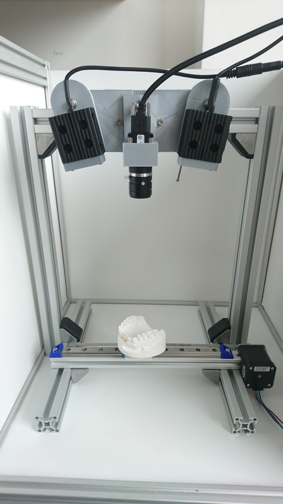
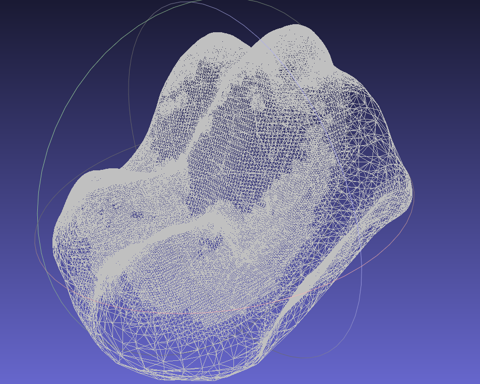
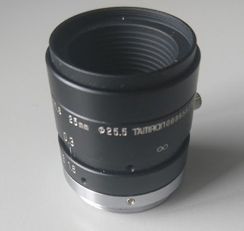
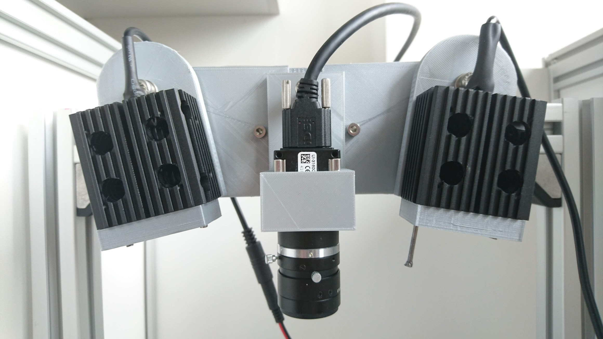
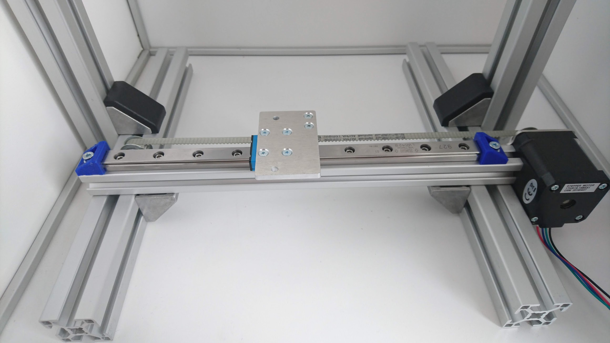
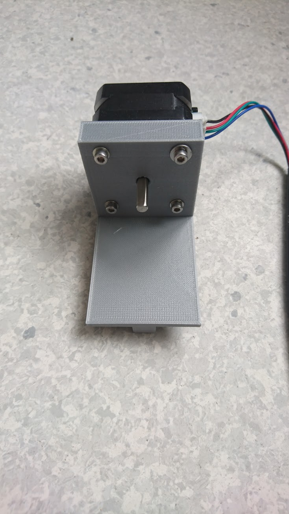

# Horus

# Work in Progress !!
# English version comming soon !!

## Einleitung
Dies ist ein Projekt des

[Department of Conservative Dentistry and Periodontology](http://www.klinikum.uni-muenchen.de/Poliklinik-fuer-Zahnerhaltung-und-Parodontologie/de/index.html),
University Hospital, LMU Munich, Germany

unter der Leitung von [Herrn Prof. Dr. Karl-Heinz Kunzelmann](http://www.dent.med.uni-muenchen.de/~kkunzelm/htdocs/index.html).

Das Projekt basiert auf der eindrucksvollen Arbeit von [Jesús Arroyo Torrens](https://github.com/Jesus89) im Zusammenhang mit dem [Cyclop 3D-Scanner](https://github.com/LibreScanner/ciclop).

Unser Projekt hatte mehrere Teilziele:

- Unterstützung von Industriekameras der Firma IDS
- Softwareunterstützung einer linearen Bewegung des Probentisches als Ergänzung zur Rotation des Probentisches des Original Cyclop Scanners
- Entwicklung eines einfachen 3D-Scanners mit linearer Bewegung des Probentisches unter Verwendung der Horus Firmware

Obwohl zahlreiche 3D Scanner auf Grundlage von Lasertriangulation kommerziell angeboten werden, war es schwer, einen Scanner zu finden, der alle unsere Anforderungen erfüllen konnte:

- Open Source Software
- Kostengünstige Hardware, die flexibel an unterschiedliche Meßanforderungen angepaßt werden kann
- Hohe Auflösung, z.B. 20 µm zur Vermessung von Zähnen
- Vermessung von Objekten unterschiedlicher Größe
- einfache Kalibrierung

Kostengünstige, kommerziell verfügbare Scanner sind meist für unsere Zwecke nicht genau genug, während Spezialscanner, beispielsweise für die Anwendung in der zahnmedizinischen Forschung, entweder keine geeigneten Schnittstellen für die Daten anbieten, die Daten durch Glätten und Komprimieren nicht die gewünschte Detailqualität bieten oder einfach unangemessen teuer sind.

Der [Cyclop 3D-Scanner](https://github.com/LibreScanner/ciclop) stellt einen sehr kostengünstigen Einstieg in die 3D Scan Techanik dar. Besonders hervorheben möchten wir, dass sowohl der Workflow als auch die Software zur Steuerung des Scanners hervorragend dokumentiert sind als auch die nötige Flexibilität für Weiterentwicklungen vorsehen.

Unsere Arbeitsgruppe beschäftigt sich seit fast 30 Jahren mit der Entwicklung und Anwendung von 3D Scannern in der Zahnmedizin ([A New Optical 3-D Device for the Detection of Wear, Journal of Dental Research 76(11):1799-807, 1997](DOI10.1177/00220345970760111201)). Während die Hardware dieser Scanner nach über 20 Jahren immer noch die erforderlichen Präzisionsmessungen erlaubt, ist die Lebenszeit der Computerhardware (Silicon Grafics, Irix Workstation) inzwischen abgelaufen, obwohl wir immer noch Messungen damit durchführen können. Das übergeordnete Ziel dieses Projektes ist es, die alte Hardware so zu modifizieren, dass sie in Zukunft in Kombination mit der Open Source Software von [Jesús Arroyo Torrens](https://github.com/Jesus89) verwendet werden kann. Langfristig streben wir an, auch andere Scanner, beispielsweise ältere 3Shape-Scanner, mit der neuen Software nachzurüsten (retrofitting).

Die Flexibilität der Scannersoftware von [Jesús Arroyo Torrens](https://github.com/Jesus89) erlaubt es jedoch, durch den Einsatz anderer Objektive, Kameras und Scannerrahmen, 3D-Scanner für fast alle Bedürfnisse mit sehr überschaubarem Aufwand zu realisieren.

In dieser Dokumentation wird ein einfacher Scanner beschrieben, auf dessen Grundlage wir die Software entwickelt und getestet haben. Das Prinzip dieses Scanners entspricht weitgehend dem mechanischen Aufbau unseres Dentalscanners ([A New Optical 3-D Device for the Detection of Wear, Journal of Dental Research 76(11):1799-807, 1997](DOI10.1177/00220345970760111201)). Der einfache Aufbau sollte nur als Träger für die Laser und Kameras dienen und war nie für Routinemessungen vorgesehen. Der Aufbau ist jedoch so zuverlässig und stabil, dass wir diesen einfachen 3D-Scanner inzwischen auch für wissenschaftliche Vermessungen verwenden. Der abgebildete Aufbau kostet ca. 800 - 1000 €. Die Komponenten können einfach bestellt werden. Für den Aufbau sind nur wenig Werkzeuge erforderlich. Einzelne Komponenten wurden mit einem 3D Drucker hergestellt. Nicht dargestellt ist ein 2-Achsen-Drehtisch für die Probenaufnahme, da die Software für dessen Steuerung noch nicht vollständig implementiert wurde.

Dieses Beispiel zeigt einen der ersten Scans eines Zahnes:

## Hardware

### Kamera
Anstelle der ursprünglich verwendeten Webcam Logitech C270 wurde durch eine Kamera mit C-Mount-Adapter verwendet. Die Wahl fiel auf ein Produkt der Firma [IDS](https://en.ids-imaging.com/home.html).

Für die Entscheidung, ein IDS Produkt zu wählen, war ausschlaggebend:

- Kompatibel mit Windows und GNU/Linux Betriebssystemen
- Industriequalität mit professionellem Langzeitsupport

Das konkret gewählte Kameramodell [UI-3160CP Rev. 2.1](https://en.ids-imaging.com/store/ui-3160cp-rev-2-1.html) hat u.a. folgende Eigenschaften

- USB 3.0 Schnittstelle
- Eine Auflösung von 1920x1200 Pixeln
- Bis zu 165 Bilder pro Sekunde bei voller Auflösung

Im Prinzip sollte man jedoch jede IDS Kamera verwenden können, die von der IDS Software Suite unterstützt wird.

#### Objektiv

Als Objektiv dient ein Tamron 1:16 25mm, d=25,5 C-Mount Objektiv

### Scankopf

Die Halterung des Scankopfes wurde mit einem 3D-Drucker erstellt. Die CAD-Files (Solidworks 2018) und STL Files befinden sich in dem Ordner [files](/files).

Der Scankopf besteht aus einer Halterung für die IDS Kamera und zwei Haltern für die Laserdioden, die in einen passenden Kühlkörper montiert sind. Die Lasersdiodenhalter lassen drehen, so dass die Laserlinie auf auf das Objekt justiert werden kann.

Für die Laser das Model *LASERNAME* verwendet. Die Halterungen *Haltername* fixieren die Laser und
sorgen für die Wärmeableitung. Die Laser bieten eine sehr feine grüne Laserlinie, diese wird weiter fokussiert
durch Linsen *Linsenname*. Der Winkel der Laser können frei justiert werden.
TODO: Laser einstellen.

### Scantisch

Der Scantisch besteht aus einer Schiene und einem kleinen Tisch, der über einen Riemen von einem Schrittmotor bewegt wird.

### Kalibriertisch

Der Kalibriertisch wird benötigt um die Parameter des Scanner zu setzten.
Der Kalibriertisch wird mittig auf dem Scantisch angebracht.
Das Schachbrettmuster wird während dem Kalibrierungsprozesses um die eigenen Achse gedreht, während die Laser
jeweils eine Linie projizieren. Durch die Rotation erkennt der Scanner die Tiefenverhältnisse des Scanbereichs.

### Materialliste

[Bill of materials (BOM)](/files/BOM-Laserscanner.ods)

Anzahl|Beschreibung|Artikelnummer|Bezugsquelle|Kosten in Euro (circa), Stand: 2017
------------ | -------------| -------------| -------------| -------------
2|Linse zur Fokussierung der Laserdiode, Achromat, D=25.4mm, F=300mm|AC254-300-A|Thorlabs|90 €
1|Kamera IDS, UI-3160CP-M-GL Rev.2|AB00687|IDS|720 €
1|USB3 Standardkabel 3m|AD00142|IDS|30 €
1|Objektiv, Tamron, M118FM25, 25 mm, C-Mount, Manuell Fokus/Iris mit Lock, 2 Megapixel|AE.0051.2.10400.00|IDS|180 €
2|GREEN DPSS LASER MODULES|CW532-001L |Roitner Lasertechnik|48 €
2|Heat Sink|SQ50 |Roitner Lasertechnik|22 €
2|Laser Power Supply 3V|LPS31 |Roitner Lasertechnik|24 €
1|Lineareinheit M200 mit 210 mm Hub|931-0011|Multec GmbH|200 €
5|Aluprofil 30x30 B-Typ Nut 8 Länge 290 mm|19617|Motedis GmbH|10 €
1|Hammermutter B-Typ Nut 8, Größe:M4, 1 Beutel (a 100 Stück)|096H08415|Motedis GmbH|13 €
1|Winkel 30 B-Typ Nut 8, mit Befestigungssatz und Abdeckkappe, 1 Beutel (a 10 Stück)|093W303N08|Motedis GmbH|16 €
1|NEMA17 12.7Ncm, Titan-Slimline Stepper Motor, D shaft |nema17-127n-titan |youprintin3d.de|16 €

### Bezugsquellen

- Thorlabs GmbH, Hans-Böckler-Strasse 6, D-85221 Dachau, Germany
- IDS Imaging Development Systems GmbH, Dimbacher Str. 6-8, D-74182 Obersulm, Germany
- Roithner Lasertechnik GmbH, Wiedner Hauptstrasse 76, A-1040 Wien, Österreich
- Motedis GmbH, Stöckerweg 122, D-66806 Ensdorf, Germany
- Multec GmbH, Hauptstr. 11, 88377 Riedhausen, Germany
- You-Print-In-3D, Evgenia Deinzer, Stephanienstr. 55, 76133 Karlsruhe

### Aufbau

#### Scankopf
TODO

#### Scankopf drucken
TODO

#### Kamera montieren
TODO

#### Linsen anbringen
TODO

#### Halterung montieren
TODO

#### Laser anbringen
TODO

### Scantisch
TODO

### Rahmen
TODO

## Änderungen der Software

### Kamera-Treiber
Um die IDS Ueye Kamera in der Python Software Horus nutzen zu können, wurden für dieses Projekt eigene Wrapper mit Cython geschrieben. Die Funktionalität der von IDS angebotenen C Funktionen wurden abstrahiert und vereinfacht.

Cython ist eine Python ähnliche Programmiersprache, die nach C kompiliert wird. Da die Standard Python Implementierung ebenfalls in C geschrieben ist, können C-Module in Python aufgerufen werden.

Der Wrapper kann in folgendem Github-Repository gefunden werden [Cyueye](https://github.com/Schwub/cyueye). Genaue Information zu den vorgenommenen Code-Änderungen finden sie in der Datei */doc/development/cyueye.md* in diesem Repository.

### Punktewolke generierung
TODO

### Scantisch Steuerung
TODO

### Installation der Software
TODO

## Scanprozess
TODO
