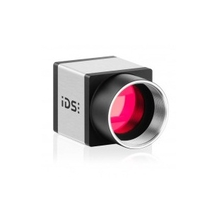

# Horus

# Work in Progress !!
# English version comming soon !!

## Einleitung
Dies ist ein Projekt der [Poliklinik für Zahnerhaltung und Parodontologie](http://www.klinikum.uni-muenchen.de/Poliklinik-fuer-Zahnerhaltung-und-Parodontologie/de/index.html)
des LMU Klinikums unter der Leitung von [Herrn Prof. Karl-Heinz Kunzelmann](http://www.dent.med.uni-muenchen.de/~kkunzelm/htdocs/index.html).
Das Projekt führt die außerordentliche Arbeit von [Jesús Arroyo Torrens](https://github.com/Jesus89) fort und erweitert den [Cyclop 3D-Scanner](https://github.com/LibreScanner/ciclop).
Das Ziel der Erweiterung ist es eine Hochwertigere Kamera für die 3D-Scans zu integrieren und statt einer Rotation eine Lineare Bewegung der Objekte zu scannen.
Die Scans der erweiterten Version waren ursprünglich dafür gedacht, Aufnahmen von Zahnkauflächen zu erstellen, der Aufbau kann jedoch auch für andere Objekte im Bereich 
zwischen 1mm^2 bis 10mm^2 genutzt werden.

Beispiel Scan eines Zahnes:

## Änderugen an der Hardware

### Kamera
Die Original Logitech Kamera wurde durch eine [UI-3160CP Rev. 2.1](https://en.ids-imaging.com/store/ui-3160cp-rev-2-1.html) der Firma [IDS](https://en.ids-imaging.com/home.html) ersetzt. 
Folgende Eigenschaften der Kamera waren ausschlaggebend für die Entscheidung des Modells:
- Eine Auflösung von 1920x1200 Pixeln
- Bis zu 165 Bilder pro Sekunde bei voller Auflösung
- Kompatibel mit Windows und GNU/Linux Betriebssystemen
- Äußerst robuste und kompakte Verarbeitung 
- USB 3.0 Schnittstelle 

#### Objektiv 

Als Objektiv dient ein Tamron 1:16 25mm, d=25,5 C-Mount Objektiv

### Scankopf

Die Halterung des Scankopfes wurde mit einem 3D-Drucker erstellt.
Die notwendigen Files können im Verzeichnis [print_files](/print_files) gefunden werden.
Der Scankopf besteht aus einer Halterung für die IDS Kamera und zwei Haltern für die Laser.
Für die Laser das Model *LASERNAME* verwendet. Die Halterungen *Haltername* fixieren die Laser und 
sorgen für die Wärmeableitung. Die Laser bieten eine sehr feine grüne Laserlinie, diese wird weiter fokussiert
durch Linsen *Linsenname*. Der Winkel der Laser können frei justiert werden. 
TODO: Laser einstellen.

### Scantisch

Der Scantisch besteht aus einer Schiene und einem kleinen Tisch, der über einen Riemen von einem Schrittmotor bewegt wird.

### Kalibriertisch

Der Kalibrietisch wird benötigt um die Parameter des Scanner zu setzten. 
Der Kalibriertisch wird mittig auf dem Scantisch angebracht.
Das Schachbrettmuster wird während dem Kalibrierungsprozesses um die eigenen Achse gedreht, während die Laser
jeweils eine Linie projizieren. Durch die Rotation erkennt der Scanner die Tiefenverhältnisse des Scanbereichs.

### Materialliste
- IDS UI-3370CP Rev. 2
	- Der Scanner wurde mit diesem Model entwickelt, jedoch funktioniert auch jede andere IDS Ueye Kamera. Bei Modellen mit einer anderen Abmaßung des Gehäuses muss der Scankopf angepasst werden.
	- C-Mount Objektiv 1:16, 25mm, d=25 (z.B.: von  Tamron)
- 2 x Laser
- 2 x Linsen
- 2 x Laserhalterung
- 2 x Schrittmotor
- Schrauben
- X-Träger
- TODO

### Aufbau

#### Scankopf 
TODO

#### Scankopf drucken
TODO

#### Kamera montieren
TODO

#### Linsen anbringen
TODO

#### Halterung montieren
TODO

#### Laser anbringen
TODO

### Scantisch
TODO

### Rahmen
TODO

## Änderungen der Software

### Kamera-Treiber
Um die IDS Ueye Kamera IDS Ueye Kamera in der Python Software Horus nutzen zu können wurden für dieses Projekt 
eigene Wrapper mit Cython geschrieben. 
Die Funktionalität der von IDS angebotenen C Funktionen wurden abstrahiert und vereinfacht.
Cython ist eine Python ähnliche Programmiersprache, die nach C kompiliert wird. 
Da die Standard Python Implementierung ebenfalls in C geschrieben ist, können C-Module in Python aufgerufen werden.
Der Wrapper kann in folgendem Github-Repository gefunden werden [Cyueye](https://github.com/Schwub/cyueye).
Genaue Information zu den Vorgenommenen Code-Änderungen finden sie in der Datei */doc/development/cyueye.md* in diesem Repository.

### Punktewolke generierung
TODO

### Scantisch Steuerung
TODO

### Instalation der Software
TODO

## Scanprozess
TODO
